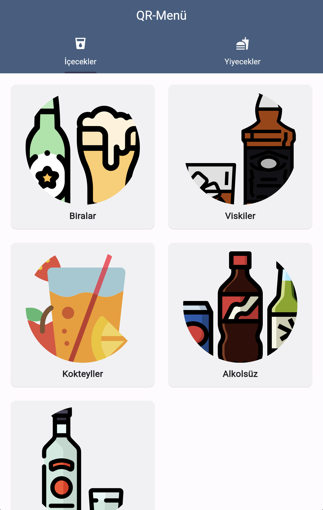
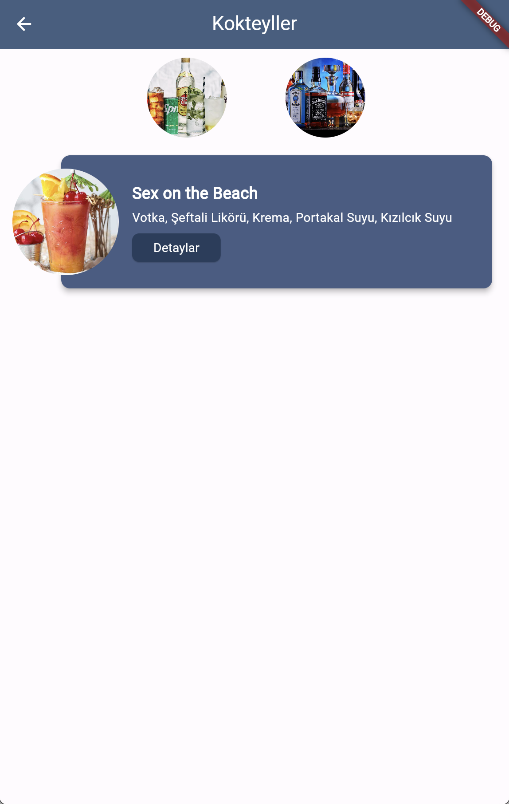
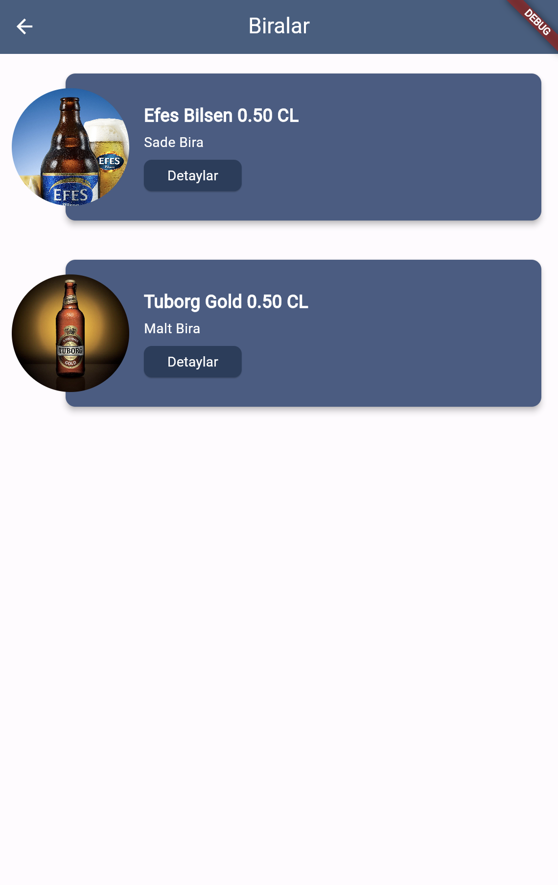
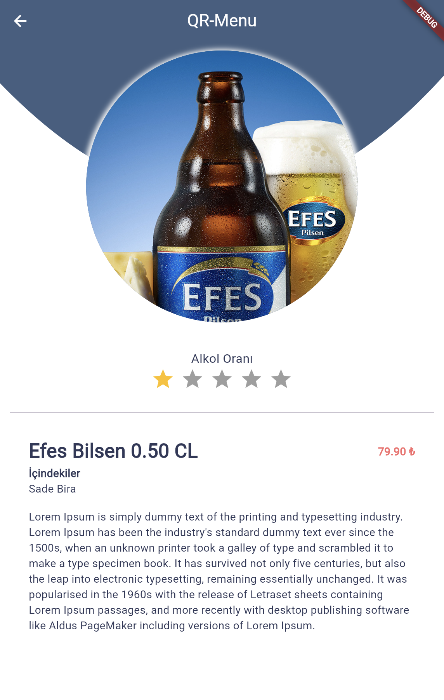
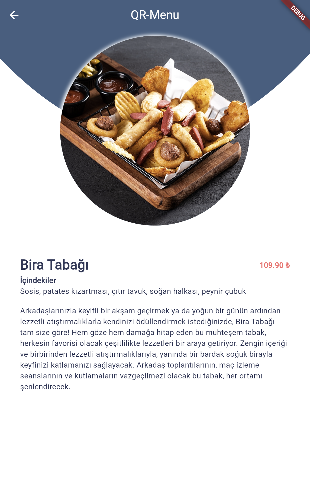

# Digital Menu Web And Mobile Application, develop with Flutter Framework

## Important Warning ! :

We have the right to take legal action in the event that the application is shared on the internet, distribution, claiming right ownership, selling it for a fee.
These codes are shared only for you to learn the Flutter.
Anyone who have access to the codes is agreed to have unconditionally accepted these terms.

All Rights Reserved.

APPBeta Mobile - www.APPBeta.net - Berk ORHAN BETA
## About
This is an Flutter application and includes 2 mobile platform and web app.

Some of the codes are removed from this example.

The system uses a SQL database.

You can review full version of this web app from https://arayuz.appbeta.net/digital-menu/

## Screenshot From Application

